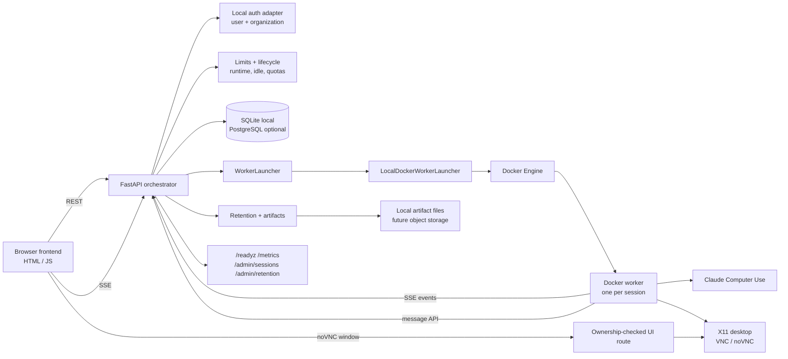

# Architecture

This project orchestrates Claude Computer Use sessions as backend workloads. The
primary invariant is one worker container per session.

## System Diagram

## Request Flow

1. Browser calls `POST /sessions`.
2. FastAPI resolves local dev identity and checks user/org session limits.
3. `WorkerLauncher` creates a local Docker worker.
4. Orchestrator waits for worker readiness and persists the session.
5. Browser connects to `GET /sessions/{id}/events`.
6. User sends `POST /sessions/{id}/messages`.
7. Worker runs Claude Computer Use and emits SSE events.
8. Orchestrator persists events/messages/status and forwards SSE to the browser.
9. Browser opens noVNC through `/sessions/{id}/ui`, optionally with a signed UI
   token.

## Persistence

SQLite is the default local database. PostgreSQL is selected with
`DATABASE_URL` and managed with Alembic migrations.

Persisted objects:

- users
- organizations
- organization memberships
- sessions
- messages
- events
- artifacts

## Worker Boundary

`WorkerLauncher` is the seam between the SaaS API layer and worker execution.
Only `local_docker` is implemented today. Future launchers can move worker
creation to an internal service, Fargate, Fly Machines, or another controlled
runtime without changing the session API shape.

## Intentional Non-Choices

- No Redis/Celery queue yet.
- No Kubernetes yet.
- No hosted auth provider yet.
- No S3/object storage yet.
- No billing or cost ledger yet.
