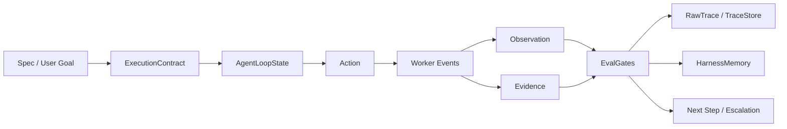

# Harness Architecture

This project is framed as an agentic harness for computer-use agents. The
FastAPI/Docker backend is a runtime surface; the harness is the control plane
that makes execution goal-directed, observable, bounded, and evidence-driven.

## Core Flow

```text
Spec -> ExecutionContract -> AgentLoopState
     -> Worker Events -> Observation/Evidence
     -> EvalGates -> Traces/Memory
     -> Next Step / Escalation
```



## What The Harness Is

The harness is the layer around an AI agent that defines:

- what the agent is trying to accomplish
- what tools it is allowed to use
- how long and how much it may spend
- what evidence must exist before completion
- how events become observations and evidence
- what is written to trace/memory
- when to continue, stop, retry, or ask a human

It is deliberately separate from the model runtime. The Claude Computer Use
worker still executes the desktop task; the harness observes and constrains that
execution.

## Problem Solved

Computer-use agents are stateful, expensive, and able to affect a desktop. A raw
chat loop can drift, claim completion too early, forget previous evidence, or
prefer its own answer. The harness makes those behaviors inspectable and
testable by turning work into contracts, state transitions, evidence, and evals.

## Failure Modes Addressed

### Agent Laziness

Problem: the agent may stop after a plausible answer without doing the required
work.

Harness response:

- `ExecutionContract.required_outputs` defines what must exist.
- `EvalGate` checks evidence instead of trusting text.
- `RawTrace` shows whether actions and observations occurred.

### Goal Drift

Problem: the agent may wander away from the original goal after several turns.

Harness response:

- `Goal` and `ExecutionContract.goal` remain stable.
- `AgentLoopState` records actions and observations against the goal.
- traces preserve the original goal next to later events.

### Premature Completion

Problem: the agent says “done” before evidence is available.

Harness response:

- `require_evidence("answer")` must pass.
- `SessionHarness` maps worker `done` events into evidence and eval results.
- missing evidence can emit `eval_failed` and escalation.

### Self-Preference

Problem: the agent may prefer its own answer over external verification.

Harness response:

- evidence is stored separately from the final message.
- workflow specs include adversarial verification patterns.
- roadmap includes independent verifier workflows and temporal knowledge graph
  memory.

## Traces And Evidence

`RawTrace` stores:

- session id
- goal
- actions
- observations
- worker/tool events
- budget/eval metadata
- final status and failure reason
- evidence paths

`Evidence` is the bridge between raw events and completion. It is the thing eval
gates can inspect. The local demo writes traces to `data/traces/...`; production
would move traces and artifacts to durable storage with retention policy.

## Runtime Connection

`SessionHarness` is the runtime adapter.

It consumes real worker-style events:

- `assistant_block`
- `tool_result`
- `screenshot`
- `done`
- `error`

And maps them into:

- `Observation`
- `Evidence`
- `EscalationDecision`
- `EvalGateResult`
- `RawTrace`

The FastAPI orchestrator creates a `SessionHarness` when a message is accepted,
then `_persist_worker_event()` forwards each persisted worker SSE event to the
harness. The worker execution path is not replaced.

The interview demo command `python3 scripts/interview_demo.py session-harness`
uses synthetic worker-style events generated by the demo script. It proves the
adapter mapping from worker event shape into `Observation`, `Evidence`, eval
results, and traces. It does not prove an end-to-end live stream from a Docker
worker running Claude Computer Use during that command. The real FastAPI
orchestrator integration exists in code through `_persist_worker_event()`, but
that full path was not exercised end-to-end in the latest verification round.

## Implemented

- custom specs and GitHub Spec Kit-style specs written manually
- agent loop dataclasses
- durable CLI runner with checkpoints
- `ExecutionContract`
- budgets and budget decisions
- tool grant policy
- eval gates
- trigger dispatcher
- file-backed memory with optional mem0 backend
- trace store
- `SessionHarness` runtime event adapter
- tmux runner wrapper
- worktree-isolated multi-agent demo
- SQLite shared task queue with `BEGIN IMMEDIATE`
- offline eval harness
- FastAPI/Docker runtime backend integration

## Roadmap

- persist full `SessionHarness` state in the primary DB
- expose `GET /sessions/{id}/harness` for live harness state
- add independent verifier agents for high-risk tasks
- add temporal knowledge graph memory such as Zep + Graphiti
- map actual tool grants into worker-enforced permissions
- track token/cost budgets from provider usage
- add remote worker launcher for hosted production
- move traces/artifacts to object storage
